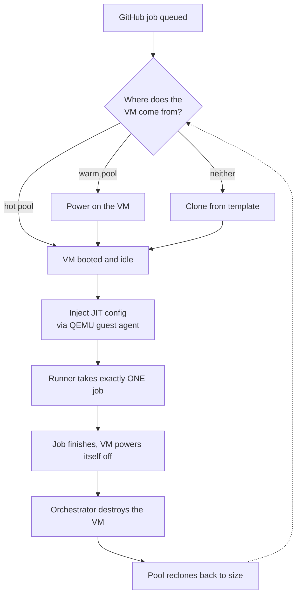

# actions-runner-scaleset-proxmox

> Ephemeral, single-use GitHub Actions self-hosted runners backed by Proxmox VMs.

[](https://github.com/jeffresc/actions-runner-scaleset-proxmox/actions/workflows/ci.yaml)
[](https://github.com/jeffresc/actions-runner-scaleset-proxmox/releases)
[](https://pkg.go.dev/github.com/jeffresc/actions-runner-scaleset-proxmox)
[](LICENSE)

Run your GitHub Actions jobs on your own Proxmox hardware, with each job in a
brand-new virtual machine that is destroyed the moment it finishes. Nothing
leaks between jobs — no cached credentials, no leftover containers, no
poisoned toolchain. Pre-booted hot and warm pools keep job start times low, so
you get the isolation of a fresh VM without paying the boot cost on every run.

**Status:** pre-1.0, in active development.

## Features

- **Ephemeral single-use VMs** — one job per VM, destroyed afterwards. No state
  survives a run.
- **Hot and warm pools** — pre-booted and pre-cloned VMs so jobs start in
  seconds, not minutes. → [scaling](docs/profiles-and-scaling.md)
- **Runner profiles** — per-shape bundles of hardware, labels, templates, and
  networks. Route GPU jobs to GPU hosts and ARM jobs to ARM templates by
  `runs-on:` labels alone. → [profiles](docs/profiles-and-scaling.md#runner-profiles)
- **Scheduled capacity** — cron-driven pool sizing, so you can run 20 warm VMs
  during business hours and 2 overnight. → [schedules](docs/profiles-and-scaling.md#scheduled-pool-sizes)
- **Cluster-aware placement** — `single`, `round_robin`, or `least_loaded` node
  selection, plus affinity and anti-affinity rules. → [node placement](docs/node-placement.md)
- **Multiple scale sets in one process** — separate orgs, labels, and VMID
  ranges, isolated so one failure can't poison the others. → [multi-scaleset](docs/multi-scaleset.md)
- **Canary template rollouts** — ship a new image to a percentage of clones,
  with automatic revert on elevated boot failures. → [canary](docs/profiles-and-scaling.md#template-canary-rollouts)
- **No SSH** — runner config is injected through the QEMU guest agent. Runner
  VMs have `openssh-server` purged entirely.
- **No database** — state lives in memory and is reconciled against Proxmox on
  every start. Nothing to back up, no migrations.
- **HA or single-process** — Raft-based leader election when you want it,
  standalone when you don't. → [deployment](docs/deployment.md)
- **Observable** — Prometheus metrics, OTLP tracing, health probes, and a
  token-protected admin API. → [operations](docs/operations.md)

## How it works

The service implements the [`actions/scaleset`](https://github.com/actions/scaleset)
`Scaler` interface and long-polls GitHub for runner demand. When a job needs a
runner, it takes a VM from the hot pool, powers on a warm one, or clones a new
one from your template. The JIT runner config is written into the VM through
the QEMU guest agent, a systemd path-unit picks it up, and the runner takes
exactly one job before shutting the VM down.



A second control loop reconciles against the GitHub REST API as a backstop for
dropped listener callbacks, and sweeps Proxmox for orphaned VMs. See
[docs/architecture.md](docs/architecture.md) for the details.

## Requirements

- **Proxmox VE**, single node or cluster, with an API token for the
  orchestrator.
- **A VM template** with the Actions runner and `qemu-guest-agent` baked in.
  [`packer/`](packer/) builds one for you.
- **A GitHub org or repo**, plus a PAT or GitHub App.

## Quick start

**1. Build the runner template** (once; rebuild monthly for security updates):

```sh
cd packer && packer init . && packer build .
```

**2. Create a Proxmox API token** — `Datacenter → Permissions → API Tokens`.
The exact privilege list is in
[docs/getting-started.md](docs/getting-started.md#2-create-the-orchestrators-proxmox-api-token).

**3. Write `config.yaml`:**

```yaml
github:
  auth_mode: pat
  pat: {}
  scope: { org: my-org }

scaleset:
  name: proxmox-ubuntu-x64
  labels: [self-hosted, linux, x64, proxmox]
  max_concurrent_runners: 50

proxmox:
  endpoint: https://pve.example.com:8006/api2/json
  auth: { token_id: scaleset@pve!automation }
  template_vmid: 9000
  vmid_range: { min: 10000, max: 19999 }
  storage: { disk: local-lvm, snippets: local }
  network: { bridge: vmbr0, vlan_tag: 0 }

nodes:
  strategy: single
  single_node: pve1

pool:
  hot_size: 2
  warm_size: 3

observability:
  http_addr: ":9100"
```

**4. Lock down the config and export the secrets** — the config file holds
credentials, so it must be mode `0600` and owned by the user the orchestrator
runs as:

```sh
chmod 600 config.yaml
export SCALESET_GITHUB_PAT_TOKEN='ghp_...'
export SCALESET_PROXMOX_AUTH_TOKEN_SECRET='...'
```

**5. Run it:**

```sh
docker run --rm \
  --user "$(id -u):$(id -g)" \
  -e SCALESET_GITHUB_PAT_TOKEN -e SCALESET_PROXMOX_AUTH_TOKEN_SECRET \
  -v "$PWD/config.yaml:/etc/scaleset/config.yaml:ro" \
  -p 9100:9100 \
  ghcr.io/jeffresc/actions-runner-scaleset-proxmox:latest
```

Then point a workflow at it:

```yaml
jobs:
  build:
    runs-on: [self-hosted, linux, x64, proxmox]   # matches scaleset.labels
    steps:
      - run: echo "hello from a disposable VM"
```

Full walkthrough, including GitHub App auth and verification steps:
**[docs/getting-started.md](docs/getting-started.md)**.

## Documentation

| Guide | What's in it |
| --- | --- |
| [Getting started](docs/getting-started.md) | End-to-end first run: template, tokens, config, verification, troubleshooting |
| [Architecture](docs/architecture.md) | Job lifecycle, VM state machine, control loops, crash recovery, package map |
| [Configuration](docs/configuration.md) | Config blocks, env-var overrides, validation rules, GHES |
| [Profiles and scaling](docs/profiles-and-scaling.md) | Hot/warm pools, profiles, label routing, networking, schedules, canaries, quotas |
| [Node placement](docs/node-placement.md) | Placement strategies and affinity rules on a PVE cluster |
| [Multiple scale sets](docs/multi-scaleset.md) | Running several scale sets in one process |
| [Deployment](docs/deployment.md) | Binary, Docker, systemd, Helm, and Raft-based HA |
| [Operations](docs/operations.md) | Metrics, tracing, admin API, runbook notes |

[config.example.yaml](config.example.yaml) is the annotated reference for every
configuration key.

## Deployment options

| | |
| --- | --- |
| **Container** | `ghcr.io/jeffresc/actions-runner-scaleset-proxmox` |
| **Helm chart** | `oci://ghcr.io/jeffresc/charts/scaleset` — see [deploy/chart/](deploy/chart/) |
| **systemd** | [deploy/systemd/scaleset.service](deploy/systemd/scaleset.service) |
| **Binary** | Attached to each [release](https://github.com/jeffresc/actions-runner-scaleset-proxmox/releases) |

See [docs/deployment.md](docs/deployment.md).

## Development

Common workflows ship as [Taskfile](https://taskfile.dev) targets — run
`task --list` to discover them:

```sh
task test    # unit tests, race-enabled
task e2e     # in-process e2e suite against fake Proxmox + fake GitHub (~30s)
task build   # compile bin/scaleset
task lint    # golangci-lint over the module
```

See [CONTRIBUTING.md](CONTRIBUTING.md) for the full dev setup.

## License

GNU General Public License 3.0 — see [LICENSE](LICENSE).
