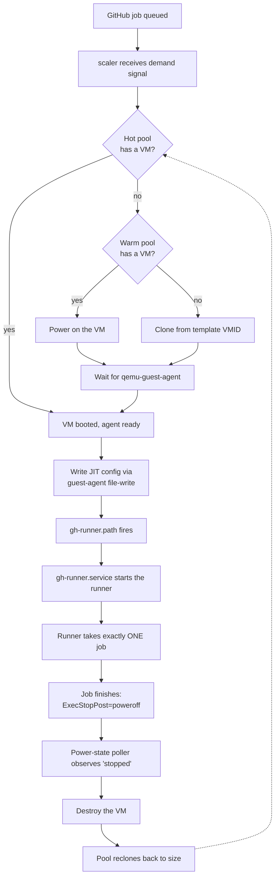

# Architecture

## The job lifecycle

The service implements the [`actions/scaleset`](https://github.com/actions/scaleset)
`Scaler` interface and long-polls GitHub for runner-demand signals. When a
runner is needed it either:

1. takes a fully-booted VM from the **hot pool**,
2. starts a pre-cloned, powered-off VM from the **warm pool**, or
3. clones a new one from the template VMID.

The JIT runner configuration is injected via the QEMU guest agent — there is no
SSH into runner VMs. A systemd path-unit inside the VM watches for the config
file, picks it up, and starts the runner. The runner takes exactly one job.
When the job finishes, the runner unit's `ExecStopPost=poweroff` shuts the VM
down; the orchestrator's power-state poller observes the transition to
`stopped` and queues destruction.

## VM state machine

Every VM the orchestrator tracks sits in exactly one state:

| State | Meaning |
| --- | --- |
| `provisioning` | Clone issued, VM not yet usable |
| `warm` | Cloned and configured, powered off |
| `booting` | Powered on, waiting for the guest agent |
| `hot` | Booted, idle, ready to accept a job |
| `assigned` | Paired with a job, runner not yet reporting work |
| `running` | Runner is executing the job |
| `draining` | Shutting down gracefully |
| `destroying` | Destroy in flight |
| `poison` | Failed to boot `pool.boot_max_attempts` times; left in place for inspection |

## The two control loops

**The scaleset listener** is the fast path. It receives `JobStarted` and
`JobCompleted` callbacks from GitHub and drives the normal lifecycle.

**The GitHub REST reconciler** is the backstop. The listener occasionally drops
callbacks or delivers them with empty fields, so the reconciler periodically
lists the GitHub runners API and joins the result against local state. It
force-destroys:

- rows stuck in `assigned` past `assigned_grace`,
- `running` rows whose runner went idle past `running_idle_grace`,
- runners that registered and then went offline past `assigned_offline_grace`.

It also sweeps Proxmox for VMs carrying the orchestrator's owner tags but with
no matching local row — with `orphan_grace` so the sweep doesn't race the boot
pipeline — and removes orphan GitHub runner registrations whose VM is gone.

Both loops' timings are configurable under `github:` and `pool:` in
[config.example.yaml](../config.example.yaml).

## State model and crash recovery

State lives in-process in
[hashicorp/go-memdb](https://github.com/hashicorp/go-memdb). There is no
on-disk database and no migrations.

When a process becomes leader it reconciles its empty view against Proxmox by
listing VMs tagged as owned by this scale set and **adopting** them — VMs left
behind by a crashed process or a previous leader are inherited, not destroyed,
so in-flight jobs survive a restart or a failover.

Two predicates identify an owned VM:

- it carries the owner tag (the normal case), **or**
- its name matches the orchestrator's VM-name prefix **and** its VMID falls
  inside the configured `vmid_range`.

The second predicate catches the rare "clone returned but the tag-apply
crashed" window. Both conditions must hold, so a human-created VM that merely
happens to sit in the range is never reaped.

Each adopted VM is classified from its Proxmox power state joined against the
GitHub runners list:

| Observed | Adopted as |
| --- | --- |
| Powered off | `warm` |
| Running, no GitHub runner | `hot` |
| Running, runner busy | `running` |
| Running, runner online and idle | `assigned` |
| Running, runner offline | `assigned` |
| Power query failed | `hot` (safe fallback) |

Adoption only has to be approximately right — the REST reconciler converges any
misclassification on its next tick. Adoption is best-effort per VM: a failure
on one VM is logged and the pass continues. If `ListOwnedVMs` itself fails
(Proxmox unreachable), the process continues with an empty pool and the orphan
sweep reaps anything stranded once Proxmox recovers.

## Package map

| Package | Purpose |
| --- | --- |
| `cmd/scaleset` | Binary entrypoint and Cobra CLI (`run`, `version`) |
| `internal/app` | Process wiring — config load, leader election, worker supervision |
| `internal/config` | YAML configuration, validation, env-var expansion |
| `internal/githubauth` | GitHub App and PAT authentication |
| `internal/scaler` | `scaleset.Scaler` implementation — acquire, JIT mint and inject, job lifecycle |
| `internal/router` | Label-matching used to flag jobs a scale set advertises for but cannot serve |
| `internal/pool` | Pool manager, VM state machine, reconcile loop |
| `internal/store` | In-memory state via `hashicorp/go-memdb` |
| `internal/provisioner` | Proxmox client wrapper, clone/start/stop/destroy, guest-agent JIT injection |
| `internal/nodeselector` | Proxmox node placement (`single` / `round_robin` / `least_loaded`) plus affinity rules |
| `internal/ipam` | IP allocation for runner NICs (`noop` / `static`) |
| `internal/schedule` | Cron-driven hot/warm pool-size overrides |
| `internal/canary` | Template canary rollouts and auto-revert |
| `internal/quotas` | Per-org / per-repo concurrency accounting |
| `internal/priority` | Priority-class matching and preemption eligibility |
| `internal/tags` | Proxmox tag schema identifying VMs owned by this scale set |
| `internal/gh` | GitHub REST reconciler — backstop for missed listener callbacks, orphan sweeps |
| `internal/adminapi` | Token-protected admin HTTP API |
| `internal/cluster` | Raft leader election and admin-API reverse-proxy to the leader |
| `internal/observability` | Structured logging, Prometheus metrics, OTLP/HTTP tracing, health probes |
| `internal/fileperm` | Permission checks on operator-supplied secret files |
| `internal/testutil` | Fake Proxmox and fake GitHub servers used by tests |

The source under `internal/...` is the canonical reference for behaviour;
package-level doc comments cover each subsystem's contract and design
rationale.
